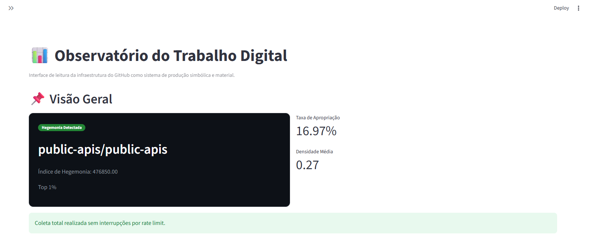
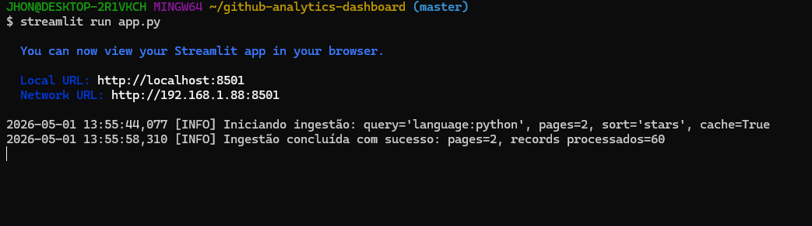

# 📊 README PROFISSIONAL (AJUSTADO À SUA ESTRUTURA)
Pode substituir seu `README.md` por isso 👇
# 📊 GitHub Analytics Dashboard
> Análise crítica da distribuição de visibilidade no ecossistema de código aberto
## 🎥 Demonstração
## 🎥 Demonstração
[](https://www.youtube.com/watch?v=f3LHmchQ9II)
## 🧠 Sobre o Projeto
Este projeto apresenta um dashboard interativo desenvolvido com Python e Streamlit para análise de dados da API do GitHub.
Diferente de abordagens tradicionais, o objetivo não é identificar “os melhores repositórios”, mas investigar:
> **Como a visibilidade é distribuída no código aberto?**
A análise considera que métricas como *stars* funcionam como sinais sociais — frequentemente refletindo exposição acumulada, e não necessariamente qualidade técnica.
## ⚖️ Problema
- Visibilidade não é distribuída de forma equitativa  
- Projetos populares acumulam mais atenção  
- Projetos menores permanecem invisíveis  
👉 Questão central:
> **Estamos medindo qualidade ou visibilidade?**
## 🎯 Objetivo
- Coletar dados da API do GitHub  
- Processar métricas  
- Construir visualizações interativas  
- Permitir análise exploratória  
- Estimular leitura crítica de dados  
## 🏗️ Estrutura do Projeto
```bash
.
├── app.py                  # Ponto de entrada do app
├── core/                   # Lógica de negócio
├── services/               # Pipeline e processamento
├── infrastructure/         # Integração com API do GitHub
├── ui/                     # Interface do usuário
├── models/                 # Modelos de dados
├── data/                   # Dados locais (ex: history.csv)
├── assets/                 # Imagens e recursos visuais
├── requirements.txt        # Dependências
└── README.md
````
## 🔄 Pipeline de Dados
```
GitHub API → Coleta → Processamento → Análise → Visualização → Interface
```
---
## ⚙️ Tecnologias
* Python
* Streamlit
* Pandas
* Plotly
* Requests
* Git + GitHub
## ⚡ Funcionalidades
* 🔎 Filtro por linguagem
* 📄 Paginação da API
* 📊 Ranking por *stars*
* 📈 Métricas agregadas
* 🧾 Visualização de dados
* ⚠️ Tratamento de erros
* 🔐 Uso de token seguro
* ⚡ Cache para performance
## 📊 Insight Principal
> **A visibilidade é concentrada.**
Poucos repositórios concentram a maior parte das *stars*, indicando:
* efeito cumulativo
* desigualdade estrutural
* popularidade ≠ qualidade
## 🧪 Limitações
* Limites da API do GitHub
* Stars não representam qualidade
* Amostragem parcial
* Sem análise temporal
## 🚀 Como Executar
```bash
git clone https://github.com/jhonmax75/github-analytics-dashboard.git
cd github-analytics-dashboard
pip install -r requirements.txt
streamlit run app.py
```
---
## 🔐 Configuração
Crie:
```
.streamlit/secrets.toml
```
```toml
GITHUB_TOKEN = "seu_token_aqui"
```
## 🖼️ Interface


## 👤 Autor
**Jhon Max Polins Ribeiro**
## 💡 Consideração Final
Este projeto não busca respostas definitivas.
> **Ele propõe uma mudança de perspectiva sobre como interpretamos métricas.**
